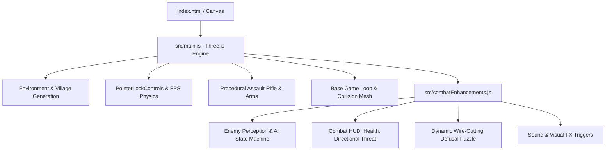

# 📋 Bomb Defusal Game — Project State & Development Log

> **Last Updated:** September 2026  
> **Repository:** [https://github.com/Snigdha-0210/Bomb_Defusal](https://github.com/Snigdha-0210/Bomb_Defusal)  
> **Status:** Active Development — Fully Playable FPS Tactical Defusal Alpha  

---

## 🧭 Quick Resume Checkpoint (Read This To Continue)

When returning to this project, here is the exact state of what is working, how the files are wired, and where to pick up next:

1. **How to Run**:
   ```bash
   npm install
   npm run dev
   # Open browser at http://localhost:5173/
   ```
2. **Current Entry Points**:
   - `index.html`: Base markup, HUD container, objective display, crosshair, and script loader.
   - `style.css`: Tactical HUD styling, wire buttons, overlay glassmorphism, responsive layout.
   - `src/main.js`: Core 3D engine, environment builder, weapon model, camera controls, player physics, base loop.
   - `src/combatEnhancements.js`: Advanced modular add-on imported automatically by `main.js`. Adds hearing/vision enemy AI, dynamic wire puzzles, damage vignette, threat direction compass, and E-key proximity triggers.

---

## 🏗️ Architecture & Component Breakdown



### 1. Core Engine & Rendering (`src/main.js`)
- **Three.js WebGL Engine**: Configured with `PCFSoftShadowMap`, `sRGBColorSpace`, custom fog (`0x0b1424`), and hemisphere/directional lighting for a nocturnal European village atmosphere.
- **Procedural Village Generator**: Builds houses with collision bounding boxes, cobblestone roads, street lights with point lights, barrels, crates, wooden fences, wells, and pine trees.
- **FPS Controller**: `PointerLockControls` with smooth WASD movement, sprint modifier (`Shift`), jump physics (`Space`), mouse look, and raycasted bounding-box collision detection against building walls.
- **Detailed 3D Weapon Model**: Fully built from Three.js primitives attached directly to the camera viewmodel (receiver, barrel, handguard, magazine, stock, iron sights, and tactical player arms/hands).
- **Shooting System**: Raycasting from screen center, muzzle flash particle cone, dynamic muzzle point light, bullet tracer logic, and hit-detection against enemy meshes.

### 2. Combat & Tactical AI Enhancements (`src/combatEnhancements.js`)
- **Enemy Perception System**:
  - **Vision**: Field of view cone ($58^\circ$, up to 36m) with obstruction checks against building obstacles.
  - **Hearing**: Gunshot sound propagation ($40\text{m}$ radius) immediately alerts patrolling enemies to investigate player coordinates.
- **Enemy AI State Machine**:
  - `patrol`: Wanders the village randomly with turn timers and boundary bounds.
  - `investigate`: Moves with elevated urgency toward suspicious noise/gunfire locations.
  - `attack`: Stalks player, maintains tactical distance ($8\text{m} - 15\text{m}$), aims weapon, flashes muzzle, and fires burst rounds with accuracy variance.
  - `search`: Searches last-known player location if line of sight is broken.
  - `reload`: Retreats or pauses when 8-round magazine is depleted.
- **Player Damage & Threat HUD**:
  - 100 HP health bar with red vignette damage flashes.
  - Dynamic 3D-to-2D directional threat indicators pointing towards attackers.
  - Floating status markers above hostile combatants.

### 3. Bomb Defusal Puzzle System (`src/combatEnhancements.js` & `src/main.js`)
- **Proximity Detection**: Press `E` when within interaction radius ($4.8\text{m}$) of the pulsing C4 bomb device.
- **Puzzle Mechanics**:
  - Dynamic randomized wire configurations (Red, Blue, Green, Yellow, White, Black).
  - Algorithmic defusal rules (e.g., "Cut Red before Blue", "Cut highest frequency wire", "Cut odd wire if even conditions match").
  - Visual status feedback, countdown timer pressure, and victory/detonation states.

---

## 📊 Summary of Work Completed So Far

| Phase | Feature | Status | Notes |
|---|---|:---:|---|
| **Phase 1** | Three.js Project Scaffold & Vite Setup | ✅ Complete | ESM modules, hot reload, build scripts |
| **Phase 1** | Nocturnal Village Scene & Environment | ✅ Complete | Houses, roads, lighting, props, collision boxes |
| **Phase 2** | FPS Controls & Camera Physics | ✅ Complete | PointerLock, jumping, collision sliding, sprinting |
| **Phase 2** | First-Person Weapon & Arms Rig | ✅ Complete | Geometric procedural M4 assault rifle + player arms |
| **Phase 3** | Shooting Mechanics & Hit Reg | ✅ Complete | Raycast shooting, muzzle flash, recoil animation |
| **Phase 3** | Enemy Spawning & Models | ✅ Complete | 6 patrol enemies scattered across village |
| **Phase 4** | Advanced Combat AI (`combatEnhancements.js`) | ✅ Complete | Vision FOV, sound hearing, states, reload cycles |
| **Phase 4** | Threat & Health HUD | ✅ Complete | Directional compass, damage vignette, health bar |
| **Phase 5** | Bomb Model & Defusal UI | ✅ Complete | Interactive wire-cutting puzzle modal, proximity 'E' prompt |
| **Phase 5** | Production Build & Asset Pipeline | ✅ Complete | Zero warnings build, generated cinematic assets |

---

## 🚀 Recommended Next Steps & Roadmap

1. **Audio Implementation (Web Audio API / Howler.js)**:
   - Positional 3D audio for gunfire, footsteps, bomb beeping, and ambient nocturnal village wind.
2. **Multi-Stage Bomb Modules**:
   - Add keypad code puzzle (finding clues on village houses) + Simon Says memory module.
3. **Round Progression & Wave Difficulty**:
   - Level 2+ with increased enemy count, snipers on rooftops, and shorter bomb timers.
4. **Mini-Map / Radar HUD**:
   - Tactical top-down radar in the bottom-left corner showing detected hostiles and bomb waypoint.
5. **Mobile / Gamepad Support**:
   - Touch joysticks or standard gamepad controller integration.

---

## 🛠️ Key Global Variables & Debugging Flags

- `window.__enhancedEnemyAI`: Set to `true` to enable enhanced AI subsystem.
- `CONFIG.enemy`: Adjustable AI parameters (speeds, ranges, damage values, reload durations).
- `CONFIG.bomb.interactionDistance`: Distance threshold to trigger defusal UI ($4.8\text{m}$).
