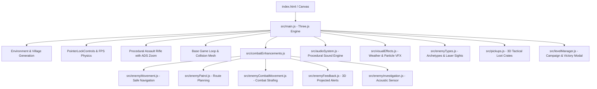

# 📋 Bomb Defusal Game — Project State & Development Log

> **Last Updated:** September 2026  
> **Repository:** [https://github.com/Snigdha-0210/Bomb_Defusal](https://github.com/Snigdha-0210/Bomb_Defusal)  
> **Status:** Active Development — Fully Playable Multi-Level Tactical FPS with Visual & Audio Overhaul  

---

## 🧭 Quick Resume Checkpoint (Read This To Continue)

When returning to this project, here is the exact state of what is working, how the files are wired, and where to pick up next:

1. **How to Run**:
   ```bash
   npm install
   npm run dev
   # Open browser at http://localhost:5173/ (or active vite port)
   ```

2. **Current Entry Points & Subsystems**:
   - `index.html`: Base markup, modern HUD layout (Top Level/Score, Objective, Center Crosshair + Hitmarker, Score Popups, Bottom-Left Sonar Radar, Bottom-Right Ammo counter).
   - `style.css`: Military glassmorphism HUD styles, circular radar sweep, hitmarker X animations, reload alert flashing.
   - `src/main.js`: Core 3D engine, village generation, weapon model, camera controls, player physics, ADS right-click zoom, tactical radar rendering, game loop.
   - `src/combatEnhancements.js`: Advanced combat orchestrator, health HUD, threat direction indicators, wire-cutting puzzle modal, house collisions.
   - `src/audioSystem.js`: Procedural Web Audio API sound synthesis (gunshots, hitmarkers, headshot chimes, reload sounds, bomb tempo beeps, wire snips, fanfares, explosions, loot chimes).
   - `src/visualEffects.js`: Particle systems (wall sparks, blood splatters, muzzle smoke), weather engine (rain particles, thunder/lightning flashes, crimson alerts), camera screen shake.
   - `src/enemyTypes.js`: Enemy archetype definitions (Assault, Scout Rusher, Marksman Sniper with red tracking laser beam, Heavy Enforcer).
   - `src/pickups.js`: Tactical 3D glowing collectible drops (Health Medkits and Ammo Crates).
   - `src/levelManager.js`: Campaign progression controller, combat statistics (Accuracy %, Kills, Headshots, Time Bonus), Victory modal with Rank calculation (S/A/B/C) and seamless level loading.
   - `src/enemyMovement.js`: Collision-safe navigation, X/Z axis separation sliding against buildings, 8-angle obstacle escape recovery.
   - `src/enemyPatrol.js`: Persistent randomized route planning within village bounds, stuck-state recovery, natural pause intervals, smooth yaw rotation.
   - `src/enemyCombatMovement.js`: Dynamic combat repositioning (long-range advance, close-quarters retreat, timed lateral strafes, aggressive flanking pushes).
   - `src/enemyFeedback.js`: 3D-to-2D projected exclamation markers (`!`) tracking over alerted hostiles and "ENEMY SPOTTED" HUD banner.
   - `src/enemyInvestigation.js`: Gunshot acoustic sensor ($22\text{m}$ radius), response delays, and pathing toward audio origin.

---

## 🏗️ Architecture & Component Breakdown



---

## 📊 Summary of Work Completed So Far

| Phase | Feature | Status | Notes |
|---|---|:---:|---|
| **Phase 1** | Three.js Project Scaffold & Vite Setup | ✅ Complete | ESM modules, hot reload, build scripts |
| **Phase 1** | Nocturnal Village Scene & Environment | ✅ Complete | Houses, roads, lighting, props, collision boxes |
| **Phase 2** | FPS Controls & Camera Physics | ✅ Complete | PointerLock, jumping, collision sliding, sprinting |
| **Phase 2** | First-Person Weapon & Arms Rig | ✅ Complete | Geometric procedural M4 assault rifle + player arms |
| **Phase 2** | ADS (Aim Down Sights) Zoom | ✅ Complete | Right-click smooth FOV ($48^\circ$) and centered weapon alignment |
| **Phase 3** | Shooting Mechanics & Hit Reg | ✅ Complete | Raycast shooting, muzzle flash, recoil animation |
| **Phase 3** | Ammo & Reload System | ✅ Complete | Magazine ($30/90$), reload on `R` with animated HUD alert |
| **Phase 3** | Audio Engine (Web Audio API) | ✅ Complete | Zero-asset procedural gunshots, hitmarkers, reload, bomb beeps |
| **Phase 4** | Visual Effects & Particle Weather | ✅ Complete | Wall sparks, blood hits, rain storm, lightning, screen shake |
| **Phase 4** | Enemy Archetypes & Laser Sights | ✅ Complete | Assault, Scout, Sniper (red laser beam), Heavy |
| **Phase 4** | Tactical 3D Drops & Pickups | ✅ Complete | Medkits (+35 HP) and Ammo boxes dropped on kill |
| **Phase 4** | Advanced Combat AI & Vision FOV | ✅ Complete | Vision FOV, sound hearing, states, reload cycles |
| **Phase 4** | 3D-to-2D Projected Feedback Markers | ✅ Complete | Floating alert & spotted banner above hostiles |
| **Phase 4** | Tactical Sonar Radar HUD | ✅ Complete | 2D circular scanner displaying hostile blips & bomb waypoint |
| **Phase 5** | Multi-Level Campaign Progression | ✅ Complete | Levels 1-4+ with weather moods, new bomb coordinates & Victory Modal |
| **Phase 5** | Bomb Model & Wire Defusal UI | ✅ Complete | Interactive wire-cutting puzzle modal, proximity 'E' prompt |
| **Phase 5** | Production Build & Asset Pipeline | ✅ Complete | 19 modules bundled, 0 errors, generated cinematic artwork |

---

## 🚀 Recommended Next Steps & Future Roadmap

1. **Keypad Code Module**:
   - Secondary defusal requirement where player finds 4-digit code written on village walls.
2. **Additional Weapon Loadouts**:
   - Switchable secondary Tactical Shotgun / Suppressed Pistol on `1` / `2` keys.
3. **High Score Persistence**:
   - Save high scores, level times, and accuracy rankings in `localStorage`.
4. **Mobile & Gamepad Support**:
   - Touch joysticks or standard gamepad controller integration.

---

## 🛠️ Key Global Variables & Debugging Flags

- `window.houseCollisions`: Array of house bounding boxes used for collision detection across modules.
- `window.CONFIG`: Global game and AI tuning parameters (speeds, ranges, damage, reload times).
- `window.__enhancedEnemyAI`: Set to `true` to enable enhanced AI subsystem.
- `window.onLevelVictory`: Callback hooked into defusal success to trigger level completion screen.
