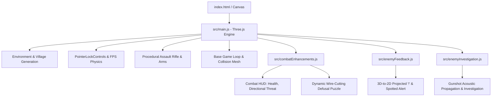

# 📋 Bomb Defusal Game — Project State & Development Log

> **Last Updated:** September 2026  
> **Repository:** [https://github.com/Snigdha-0210/Bomb_Defusal](https://github.com/Snigdha-0210/Bomb_Defusal)  
> **Status:** Active Development — Fully Playable FPS Tactical Defusal Alpha  

---

## 🧭 Quick Resume Checkpoint (Read This To Continue)

When returning to this project, here is the exact state of what is working, how the files are wired, and where to pick up next:

1. **How to Run**:
   ```bash
   npm install
   npm run dev
   # Open browser at http://localhost:5173/
   ```
2. **Current Entry Points & File Roles**:
   - `index.html`: Base markup, HUD container, objective display, crosshair, and script loader.
   - `style.css`: Tactical HUD styling, wire buttons, overlay glassmorphism, responsive layout.
   - `src/main.js`: Core 3D engine, environment builder, weapon model, camera controls, player physics, base loop.
   - `src/combatEnhancements.js`: Advanced combat add-on (threat direction compass, player damage vignette, wire-cutting puzzle modal, house collisions).
   - `src/enemyFeedback.js`: Visual detection feedback subsystem (3D-to-2D projected exclamation markers `!` above spotted enemies and "ENEMY SPOTTED" HUD banner).
   - `src/enemyInvestigation.js`: Modular gunshot acoustic detection ($22\text{m}$ radius), response delays, and pathing toward audio coordinates.

---

## 🏗️ Architecture & Component Breakdown



### 1. Core Engine & Rendering (`src/main.js`)
- **Three.js WebGL Engine**: Configured with `PCFSoftShadowMap`, `sRGBColorSpace`, custom fog (`0x0b1424`), and hemisphere/directional lighting for a nocturnal European village atmosphere.
- **Procedural Village Generator**: Builds houses with collision bounding boxes (`window.houseCollisions`), cobblestone roads, street lights with point lights, barrels, crates, wooden fences, wells, and pine trees.
- **FPS Controller**: `PointerLockControls` with smooth WASD movement, sprint modifier (`Shift`), jump physics (`Space`), mouse look, and raycasted bounding-box collision detection against building walls.
- **Detailed 3D Weapon Model**: Fully built from Three.js primitives attached directly to the camera viewmodel (receiver, barrel, handguard, magazine, stock, iron sights, and tactical player arms/hands).
- **Shooting System**: Raycasting from screen center, muzzle flash particle cone, dynamic muzzle point light, bullet tracer logic, and hit-detection against enemy meshes.

### 2. Tactical Enemy Feedback & Markers (`src/enemyFeedback.js`)
- **Visual Alert Banner**: "ENEMY SPOTTED" header with glow shadow and smooth fade animations when an enemy acquires line of sight on the player.
- **Screen-Projected Markers**: Calculates dynamic 3D world coordinates above hostile meshes and projects to 2D screen pixels ($x, y$) for a floating tactical exclamation mark (`!`), automatically occluding when targets are behind the camera view frustum.

### 3. Modular Investigation System (`src/enemyInvestigation.js`)
- **Gunshot Acoustic Sensor**: Registers player firing positions within $22\text{m}$ radius.
- **Reaction Delay & State Transition**: Implements human-like cognitive delays ($0.15\text{s} - 0.65\text{s}$) before transitioning unalerted sentries from `patrol` into `investigate`, moving them towards the audio origin and initiating a localized search pattern upon arrival.

### 4. Combat & Threat Subsystem (`src/combatEnhancements.js`)
- **Vision FOV ($58^\circ$, $36\text{m}$)**: Line-of-sight raycasts occluded by village houses.
- **Combat HUD**: 100 HP health bar, red vignette damage flashes, 3D-to-2D directional threat indicators pointing towards active shooters.
- **Bomb Defusal Puzzle System**: Proximity-triggered (`E` key within $4.8\text{m}$) wire-cutting modal with randomized color sequences and algorithmic defusal rules.

---

## 📊 Summary of Work Completed So Far

| Phase | Feature | Status | Notes |
|---|---|:---:|---|
| **Phase 1** | Three.js Project Scaffold & Vite Setup | ✅ Complete | ESM modules, hot reload, build scripts |
| **Phase 1** | Nocturnal Village Scene & Environment | ✅ Complete | Houses, roads, lighting, props, collision boxes |
| **Phase 2** | FPS Controls & Camera Physics | ✅ Complete | PointerLock, jumping, collision sliding, sprinting |
| **Phase 2** | First-Person Weapon & Arms Rig | ✅ Complete | Geometric procedural M4 assault rifle + player arms |
| **Phase 3** | Shooting Mechanics & Hit Reg | ✅ Complete | Raycast shooting, muzzle flash, recoil animation |
| **Phase 3** | Enemy Spawning & Models | ✅ Complete | 6 patrol enemies scattered across village |
| **Phase 4** | Advanced Combat AI & Vision FOV | ✅ Complete | Vision FOV, sound hearing, states, reload cycles |
| **Phase 4** | Enemy Feedback & 3D Projected Markers | ✅ Complete | `enemyFeedback.js` with floating alert & spotted banner |
| **Phase 4** | Modular Gunshot Investigation AI | ✅ Complete | `enemyInvestigation.js` acoustic sensor & search pathing |
| **Phase 5** | Bomb Model & Wire Defusal UI | ✅ Complete | Interactive wire-cutting puzzle modal, proximity 'E' prompt |
| **Phase 5** | Production Build & Asset Pipeline | ✅ Complete | Zero warnings build, generated cinematic assets |

---

## 🚀 Recommended Next Steps & Roadmap

1. **Audio Implementation (Web Audio API / Howler.js)**:
   - Positional 3D audio for gunfire, footsteps, bomb beeping, and ambient nocturnal village wind.
2. **Multi-Stage Bomb Modules**:
   - Add keypad code puzzle (finding clues on village houses) + Simon Says memory module.
3. **Round Progression & Wave Difficulty**:
   - Level 2+ with increased enemy count, snipers on rooftops, and shorter bomb timers.
4. **Mini-Map / Radar HUD**:
   - Tactical top-down radar in the bottom-left corner showing detected hostiles and bomb waypoint.
5. **Mobile / Gamepad Support**:
   - Touch joysticks or standard gamepad controller integration.

---

## 🛠️ Key Global Variables & Debugging Flags

- `window.houseCollisions`: Array of house bounding boxes used for collision detection across modules.
- `window.__enhancedEnemyAI`: Set to `true` to enable enhanced AI subsystem.
- `CONFIG.enemy`: Adjustable AI parameters (speeds, ranges, damage values, reload durations).
- `CONFIG.bomb.interactionDistance`: Distance threshold to trigger defusal UI ($4.8\text{m}$).
