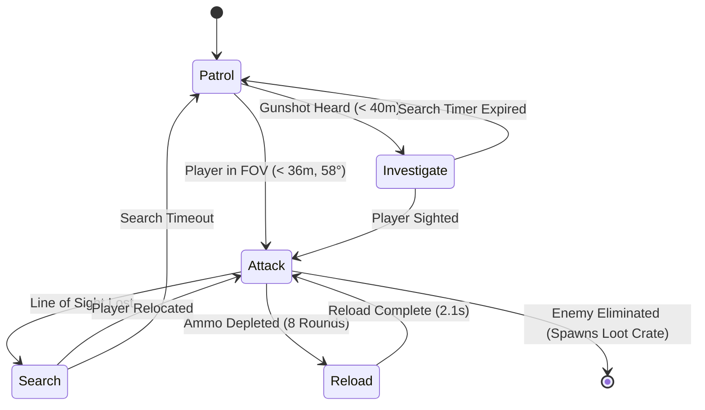
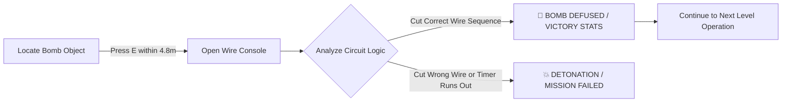

# 💣 BOMB DEFUSAL — Tactical 3D First-Person Game

<div align="center">


[](https://threejs.org/)
[](https://vitejs.dev/)
[](https://developer.mozilla.org/en-US/docs/Web/JavaScript)
[](./LICENSE)
[]()

**An intense, atmospheric 3D tactical FPS and bomb defusal simulation built for the web with Three.js and Vite.**

[🎮 Play Locally](#-getting-started) • [🕹️ Controls](#-controls--mechanics) • [🧠 AI Architecture](#-enemy-ai--tactical-systems) • [🧩 Defusal Guide](#-bomb-defusal-puzzle-system) • [📋 Project State](./PROJECT_STATE.md)

</div>

---

## 📖 Overview

**Bomb Defusal** immerses players into the boots of a solo tactical operative dropped into an occupied European village. Your mission across escalating operations: locate the high-explosive C4 charge hidden within the perimeter, eliminate hostile combatant squads, collect tactical drops, and defuse intricate wire-circuit systems before the countdown expires.

Built with vanilla JavaScript and **Three.js**, featuring procedural 3D weapon viewmodels with **ADS Zoom**, procedural **Web Audio API sound synthesis**, particle weather effects (rain, lightning, sparks), multi-class enemy archetypes, tactical radar, and campaign progression.

---

## ✨ Key Features

- 🎯 **Full 3D FPS Experience**: First-person camera with `PointerLockControls`, WASD locomotion, sprint modifier, jump physics, and building collision detection.
- 🔭 **Aim Down Sights (ADS)**: Right-click smoothly shifts weapon into precision iron-sights, tightens crosshairs, and narrows camera FOV ($48^\circ$).
- 🔫 **Tactical Ammo & Reload System**: Magazine management ($30/90$) with realistic reload animation and audio cues triggered on `R`.
- 🔊 **Procedural Web Audio Engine**: Zero-asset procedural audio synthesizing punchy gunshots, hitmarkers, headshot chimes, reload mechanical clicks, bomb tempo countdown beeps, wire snips, and victory fanfares.
- 🌧️ **Dynamic Atmosphere & Particle VFX**: Weather systems featuring nocturnal fog, rain storms with thunder and lightning flashes, crimson alert beacons, bullet impact sparks, blood hits, and camera screen shake.
- 🪖 **Diverse Enemy Archetypes**:
  - 🛡️ **Assault Guard**: Standard balanced rifleman with tactical strafing.
  - ⚡ **Scout Rusher**: High-speed flanker closing the distance rapidly.
  - 🎯 **Marksman Sniper**: Strategic long-range sentry armed with a visible red laser targeting beam.
  - 🦾 **Heavy Enforcer**: Armored boss unit guarding the bomb perimeter.
- 📦 **3D Tactical Loot Drops**: Fallen enemies drop glowing Health Medkits ($+35$ HP) and Ammo Crates ($+30$ ammo).
- 📡 **Tactical Sonar Radar HUD**: Real-time circular minimap scanner tracking hostile blips and the pulsing bomb waypoint.
- 🏆 **Multi-Level Campaign Progression**: Seamless transition across Level 1 (Infiltration), Level 2 (Thunderstorm Siege), Level 3 (Rooftop Marksmen), and Level 4 (Red Alert Outpost) with complete Victory rank summaries (Rank S/A/B/C, Accuracy %, Kills, Time Bonus).
- ✂️ **Interactive Wire-Cutting Defusal**: Proximity-triggered (`E`) tactical defusal interface featuring randomized wire circuits, algorithmic rules, and detonation sequences.

---

## 🕹️ Controls & Mechanics

| Key / Action | Action | Description |
|---|---|---|
| **Mouse Move** | **Look / Aim** | 360° first-person camera aim |
| **Left Click** | **Fire Weapon** | Shoots bullet raycast, alerts nearby enemies within hearing radius |
| **Right Click (Hold)** | **Aim Down Sights (ADS)** | Zooms FOV to $48^\circ$, centers weapon viewmodel for precision aim |
| **`R`** | **Reload Weapon** | Reloads current magazine from reserve ammo ($30/90$) |
| **`W` `A` `S` `D`** | **Movement** | Move forward, left, backward, right |
| **`Shift`** | **Sprint** | Increases movement speed across the village |
| **`Space`** | **Jump** | Vertical jump with gravity physics |
| **`E`** | **Defuse Bomb** | Interacts with the C4 charge when within $4.8\text{m}$ proximity |
| **`Esc`** | **Pause / Release Mouse** | Releases PointerLock cursor |

---

## 🏗️ System Architecture

```mermaid
graph TB
    subgraph Client ["Client Browser Runtime"]
        HTML["index.html (HUD, Sonar Radar, Ammo Counter)"]
        CSS["style.css (Military Glassmorphism UI)"]
    end

    subgraph CoreEngine ["Core 3D Engine (src/main.js)"]
        ThreeScene["Three.js Scene & Lighting Pipeline"]
        FPSControls["PointerLockControls & Physics"]
        WeaponView["Procedural M4 Rifle with ADS & Bob"]
        GameLoop["Game Render Loop (60 FPS)"]
    end

    subgraph Systems ["Modular Gameplay & Tactical Subsystems"]
        Audio["src/audioSystem.js (Procedural Web Audio Engine)"]
        VFX["src/visualEffects.js (Weather, Sparks, Lightning & Shake)"]
        Archetypes["src/enemyTypes.js (Assault, Scout, Sniper with Laser, Heavy)"]
        Pickups["src/pickups.js (3D Medkits & Ammo Drops)"]
        LevelProgression["src/levelManager.js (Campaign Operations & Victory Modal)"]
        Movement["src/enemyMovement.js (Safe Navigation & Escape)"]
        Patrol["src/enemyPatrol.js (Route Planning & Stuck Recovery)"]
        CombatMove["src/enemyCombatMovement.js (Tactical Combat Strafing)"]
        Feedback["src/enemyFeedback.js (3D Screen Projection '!' & Alerts)"]
        Investigate["src/enemyInvestigation.js (Acoustic Sensor & Pathing)"]
        CombatAddon["src/combatEnhancements.js (Combat AI & Defusal Logic)"]
    end

    HTML --> CoreEngine
    CoreEngine --> Systems
    GameLoop --> Audio
    GameLoop --> VFX
    GameLoop --> Pickups
    GameLoop --> LevelProgression
    CombatAddon --> Movement
    CombatAddon --> Patrol
    CombatAddon --> CombatMove
```



---

## 🧠 Enemy AI & Tactical Systems

Enemies in **Bomb Defusal** operate using an intelligent autonomous finite-state machine (FSM):



---

## 🧩 Bomb Defusal Puzzle System

When approaching the bomb ($< 4.8\text{m}$), pressing **`E`** opens the tactical defusal interface:



- **Wire Variety**: Red, Blue, Green, Yellow, White, Black.
- **Dynamic Rules**: Randomized rules each round (color hierarchy, position indices, condition codes).

---

## 📂 Project Structure

```
BombDefusalGame/
├── assets/
│   └── banner.jpg               # Cinematic game poster & banner
├── dist/                        # Production build bundle
├── src/
│   ├── main.js                  # Three.js engine, map, player & rifle rig
│   ├── audioSystem.js           # Procedural Web Audio API sound engine
│   ├── visualEffects.js         # Particle sparks, rain storm, lightning & screen shake
│   ├── enemyTypes.js            # Enemy archetypes & sniper red laser targeting
│   ├── pickups.js               # Tactical 3D glowing health & ammo loot crates
│   ├── levelManager.js          # Campaign levels, stats tracking & Victory modal
│   ├── combatEnhancements.js    # Combat AI, health HUD, wire puzzle
│   ├── enemyMovement.js         # Safe navigation, sliding, & escape routing
│   ├── enemyPatrol.js           # Route planning, stuck recovery, & yaw turns
│   ├── enemyCombatMovement.js   # Dynamic combat repositioning & strafing
│   ├── enemyFeedback.js         # 3D projected markers & spotted HUD banner
│   └── enemyInvestigation.js    # Gunshot acoustic sensor & investigation pathing
├── index.html                   # Game HTML shell & HUD elements
├── style.css                    # Tactical dark-mode HUD styling
├── package.json                 # Project configuration & npm scripts
├── PROJECT_STATE.md             # Detailed developer resumption log
├── LICENSE                      # MIT License
└── .gitignore                   # Git ignore file
```

---

## 🚀 Getting Started

### Prerequisites
- [Node.js](https://nodejs.org/) (version 18+ recommended)
- Modern WebGL-compatible browser (Chrome, Edge, Firefox, Brave, Safari)

### Installation & Launch

1. **Clone the repository**:
   ```bash
   git clone https://github.com/Snigdha-0210/Bomb_Defusal.git
   cd Bomb_Defusal
   ```

2. **Install dependencies**:
   ```bash
   npm install
   ```

3. **Start local development server**:
   ```bash
   npm run dev
   ```

4. **Open in browser**:
   Navigate to `http://localhost:5173/` and click anywhere on the canvas to lock controls and begin!

5. **Build for production**:
   ```bash
   npm run build
   ```

---

## 📄 License

This project is distributed under the **MIT License**. See [`LICENSE`](./LICENSE) for full details.

<div align="center">
  <sub>Crafted with passion for tactical web gaming • Designed & Developed by <a href="https://github.com/Snigdha-0210">Snigdha</a></sub>
</div>
