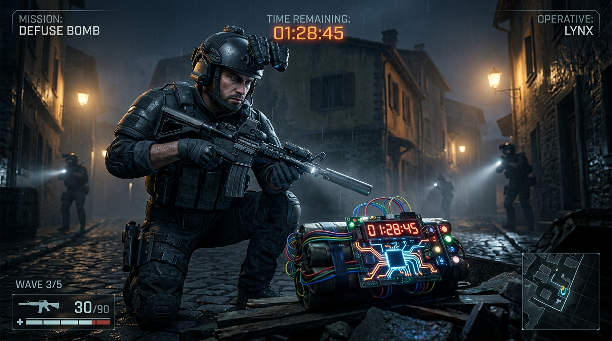
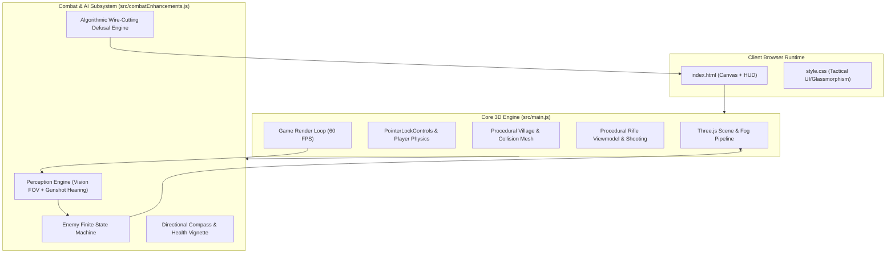
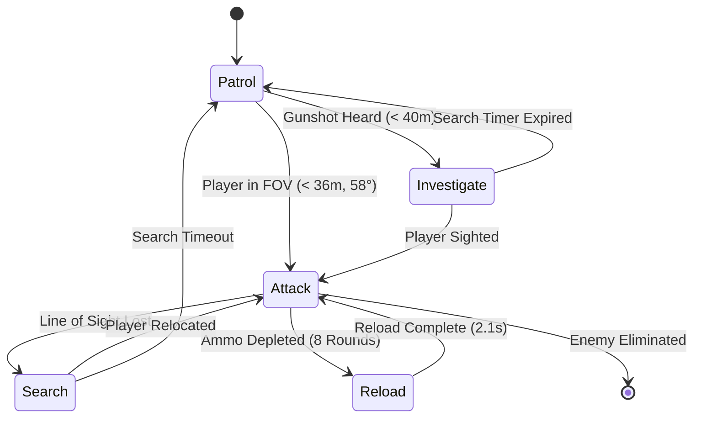
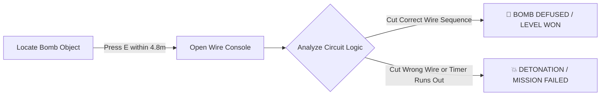

# 💣 BOMB DEFUSAL — Tactical 3D First-Person Game

<div align="center">



[](https://threejs.org/)
[](https://vitejs.dev/)
[](https://developer.mozilla.org/en-US/docs/Web/JavaScript)
[](./LICENSE)
[]()

**An intense, atmospheric 3D tactical FPS and bomb defusal simulation built for the web with Three.js and Vite.**

[🎮 Play Locally](#-getting-started) • [🕹️ Controls](#-controls--mechanics) • [🧠 AI Architecture](#-enemy-ai--tactical-systems) • [🧩 Defusal Guide](#-bomb-defusal-puzzle-system) • [📋 Project State](./PROJECT_STATE.md)

</div>

---

## 📖 Overview

**Bomb Defusal** immerses players into the boots of a solo tactical operative dropped into a dark, foggy European village occupied by hostile armed combatants. Your mission: locate the high-explosive C4 charge hidden within the perimeter, eliminate patrolling sentries, and defuse the intricate wire-circuit system before the countdown expires.

Built entirely with modern vanilla JavaScript and **Three.js**, running at 60+ FPS with custom procedural 3D weapon viewmodels, dynamic lighting, intelligent AI perception (vision FOV + sound hearing), and interactive wire-cutting puzzle mechanics.

---

## ✨ Key Features

- 🎯 **Full 3D FPS Experience**: First-person camera with `PointerLockControls`, WASD locomotion, sprint modifier, jump physics, and building collision detection.
- 🔫 **Procedural 3D Weapon Rig**: Custom-built geometric assault rifle viewmodel with procedural arms, muzzle flash particle cones, dynamic weapon lighting, and raycast shooting.
- 🧠 **Multi-State Tactical Enemy AI**: Enemies feature 5 autonomous states (`Patrol`, `Investigate`, `Attack`, `Search`, `Reload`), cone-based Vision FOV ($58^\circ$), gunshot hearing detection ($40\text{m}$ radius), and building collision avoidance.
- ✂️ **Interactive Wire-Cutting Defusal**: Proximity-triggered (`E`) tactical defusal interface featuring randomized wire circuits, algorithmic rules, countdown timer tension, and detonation sequences.
- 🗺️ **Atmospheric Nocturnal Map**: Complete procedural village environment featuring cobblestone roads, furnished houses, street lights with point lights, pine trees, barrels, crates, wooden fences, and atmospheric depth fog.
- 🩸 **Tactical HUD & Directional Threats**: Health status indicator, damage screen vignette, floating combat alert badges, and real-time 3D-to-2D threat compass arrows.

---

## 🕹️ Controls & Mechanics

| Key / Action | Action | Description |
|---|---|---|
| **Mouse Move** | **Look / Aim** | 360° first-person camera aim |
| **Left Click** | **Fire Weapon** | Shoots bullet raycast, alerts nearby enemies within hearing radius |
| **`W` `A` `S` `D`** | **Movement** | Move forward, left, backward, right |
| **`Shift`** | **Sprint** | Increases movement speed across the village |
| **`Space`** | **Jump** | Vertical jump with gravity physics |
| **`E`** | **Defuse Bomb** | Interacts with the C4 charge when within $4.8\text{m}$ proximity |
| **`Esc`** | **Pause / Release Mouse** | Releases PointerLock cursor |

---

## 🏗️ System Architecture



---

## 🧠 Enemy AI & Tactical Systems

Enemies in **Bomb Defusal** operate using an intelligent autonomous finite-state machine (FSM):



### Perception Breakdown
- **Vision ($58^\circ$ FOV, $36\text{m}$ Range)**: Enemies constantly evaluate line-of-sight vectors to the player while checking for intervening house geometry.
- **Hearing ($40\text{m}$ Radius)**: Firing your weapon without a suppressor triggers immediate sound waves, causing all sentries in range to enter `Investigate` mode.
- **Combat Engagement**: Enemies strafe, maintain tactical engagement range ($8\text{m} - 15\text{m}$), and fire bursts with simulated muzzle flash and directional sound cues.

---

## 🧩 Bomb Defusal Puzzle System

When approaching the bomb ($< 4.8\text{m}$), pressing **`E`** opens the tactical defusal interface:



- **Wire Variety**: Red, Blue, Green, Yellow, White, Black.
- **Dynamic Rules**: Randomized rules each round (e.g. cutting wires by color hierarchy, position indices, or matching condition codes).

---

## 📂 Project Structure

```
BombDefusalGame/
├── assets/
│   └── banner.jpg               # Cinematic game poster & banner
├── dist/                        # Production build bundle
├── src/
│   ├── main.js                  # Three.js engine, map, player & rifle rig
│   └── combatEnhancements.js    # Advanced AI, hearing/vision, wire puzzle
├── index.html                   # Game HTML shell & HUD elements
├── style.css                    # Tactical dark-mode HUD styling
├── package.json                 # Project configuration & npm scripts
├── PROJECT_STATE.md             # Detailed developer resumption log
├── LICENSE                      # MIT License
└── .gitignore                   # Git ignore file
```

---

## 🚀 Getting Started

### Prerequisites
- [Node.js](https://nodejs.org/) (version 18+ recommended)
- Modern WebGL-compatible browser (Chrome, Edge, Firefox, Brave, Safari)

### Installation & Launch

1. **Clone the repository**:
   ```bash
   git clone https://github.com/Snigdha-0210/Bomb_Defusal.git
   cd Bomb_Defusal
   ```

2. **Install dependencies**:
   ```bash
   npm install
   ```

3. **Start local development server**:
   ```bash
   npm run dev
   ```

4. **Open in browser**:
   Navigate to `http://localhost:5173/` and click anywhere on the canvas to lock controls and begin!

5. **Build for production**:
   ```bash
   npm run build
   ```

---

## 🗺️ Roadmap & Upcoming Features

- [x] Three.js nocturnal village environment & lighting
- [x] FPS camera controls & raycast collision sliding
- [x] First-person weapon viewmodel & muzzle VFX
- [x] Multi-state AI (Patrol, Investigate, Attack, Search, Reload)
- [x] Gunshot hearing & Vision FOV detection
- [x] Interactive wire-cutting defusal UI
- [ ] 🔊 3D Spatial Audio & sound effects (gunfire, footsteps, beeping)
- [ ] 🔢 Keypad code & Simon Says auxiliary defusal modules
- [ ] 📡 Minimap radar with hostile ping indicators
- [ ] 🎮 Multi-level progression & sniper enemy variants

---

## 🤝 Contributing

Contributions, issues, and feature requests are warmly welcomed!
Feel free to check the [issues page](https://github.com/Snigdha-0210/Bomb_Defusal/issues).

1. Fork the Project
2. Create your Feature Branch (`git checkout -b feature/AmazingFeature`)
3. Commit your Changes (`git commit -m 'Add some AmazingFeature'`)
4. Push to the Branch (`git push origin feature/AmazingFeature`)
5. Open a Pull Request

---

## 📄 License

This project is distributed under the **MIT License**. See [`LICENSE`](./LICENSE) for full details.

<div align="center">
  <sub>Crafted with passion for tactical web gaming • Designed & Developed by <a href="https://github.com/Snigdha-0210">Snigdha</a></sub>
</div>
